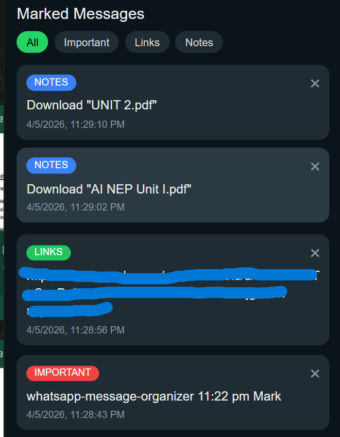
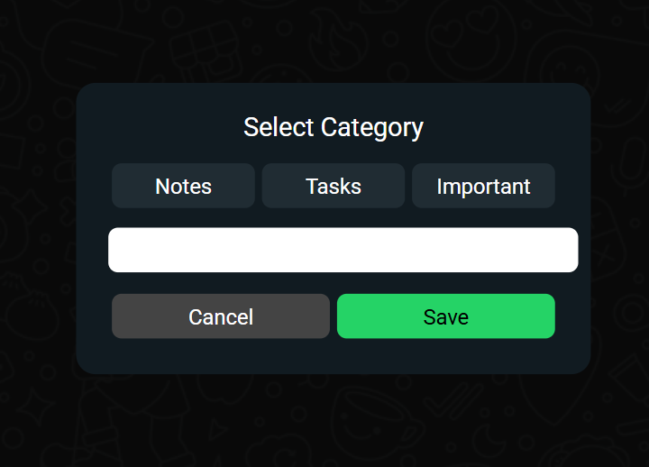
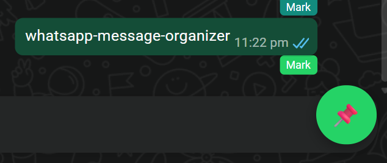

# WhatsApp Message Organizer Extension

This is a Chrome extension that enhances WhatsApp Web by allowing users to mark and organize important messages into categories like Notes, Tasks, and Important.

## 🚀 Features

- Mark any message directly inside WhatsApp Web
- Categorize messages (Notes, Tasks, Important, custom)
- Sidebar UI to view saved messages
- Filter messages by category
- Delete saved messages
- Click to navigate to message in chat
- Clean and modern UI

## 🛠️ Tech Used

- JavaScript
- Chrome Extension APIs
- DOM Manipulation

## 📦 Installation

1. Download or clone this repository
2. Open Chrome and go to:
   chrome://extensions/
3. Enable **Developer Mode**
4. Click **Load Unpacked**
5. Select this project folder

## 📸 Screenshots

## 📸 Screenshots

### Sidebar View

### Category Selection Modal

### Mark Button in Chat

## 💡 Idea

Important messages in WhatsApp groups often get lost among regular chats.  
This extension helps organize them efficiently for quick access.

---

This project was built as part of learning Chrome Extension development and improving real-world problem solving.
